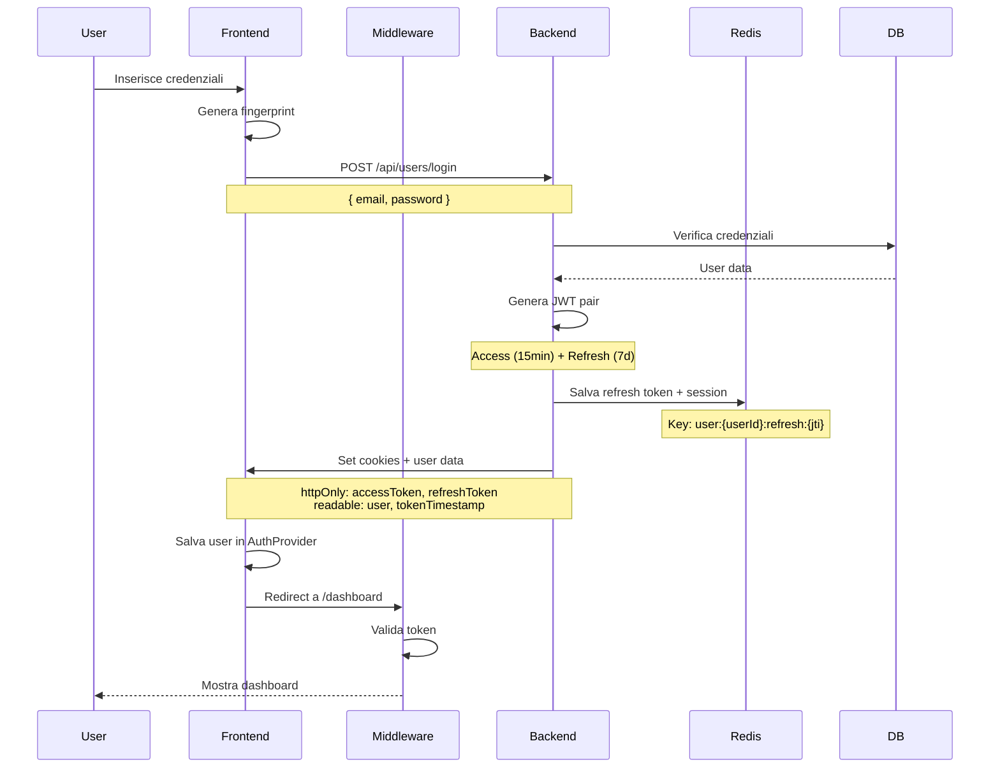
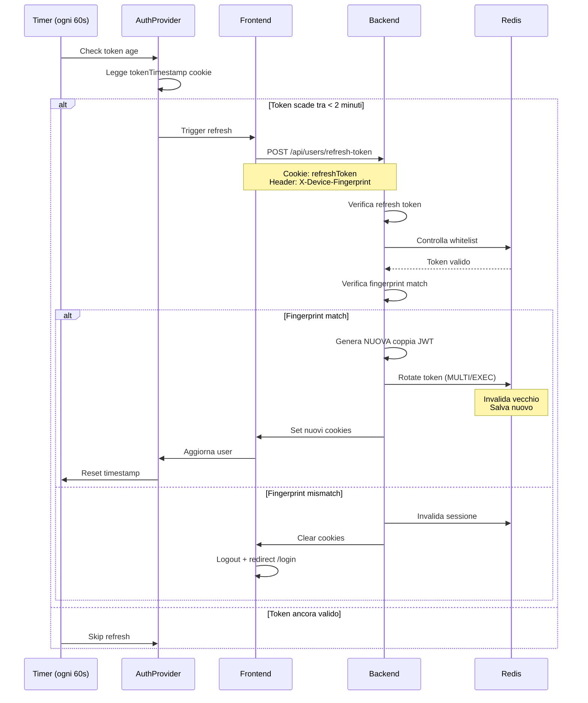
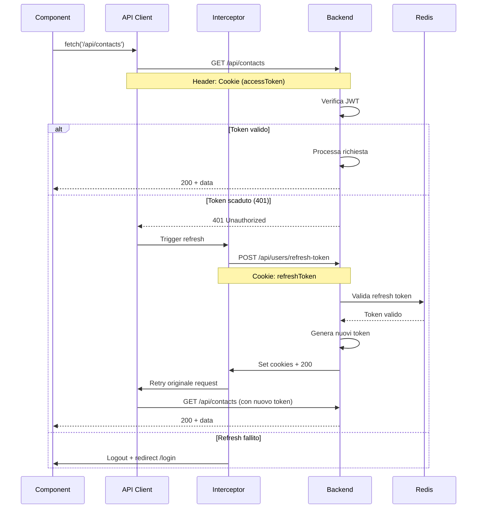
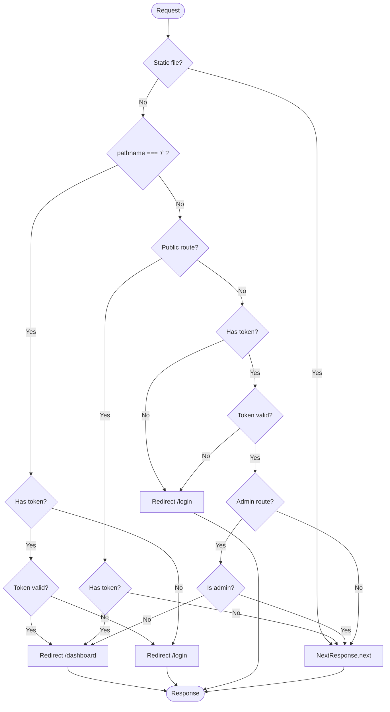
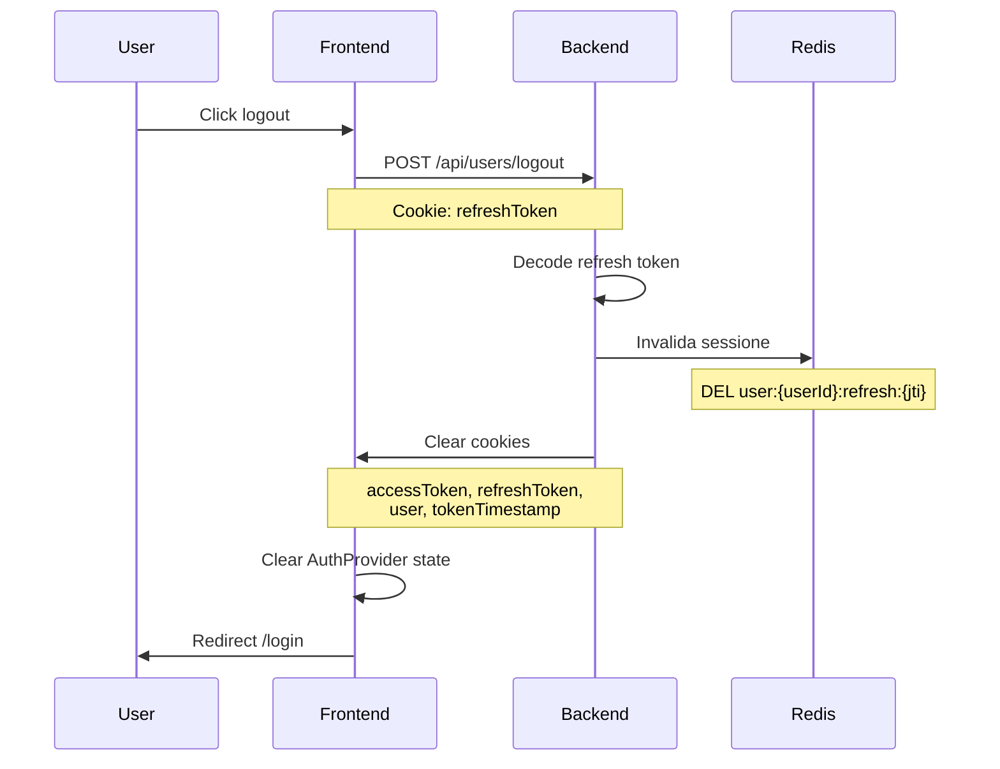

# 📄 AUTH_FLOW.md

# 🔐 Sistema di Autenticazione - Documentazione Completa

> **Mini ERP/CRM** - Auth Flow con JWT, Token Rotation, Proactive Refresh e Device Fingerprinting

---

## 📑 Indice

- [Panoramica](#panoramica)
- [Architettura Completa](#architettura-completa)
- [Flussi Principali](#flussi-principali)
  - [1. Login Flow](#1-login-flow)
  - [2. Refresh Token Proattivo](#2-refresh-token-proattivo)
  - [3. API Request con Token Scaduto](#3-api-request-con-token-scaduto)
  - [4. Middleware Protection](#4-middleware-protection)
  - [5. Logout Flow](#5-logout-flow)
- [Componenti](#componenti)
  - [Frontend](#frontend-components)
  - [Middleware](#middleware-components)
  - [Server](#server-components)
  - [Backend](#backend-components)
- [Token Structure](#token-structure)
- [Cookie Strategy](#cookie-strategy)
- [Timing & Configuration](#timing--configuration)
- [Security Features](#security-features)
- [Esempi di Codice](#esempi-di-codice)
- [Environment Variables](#environment-variables)
- [Testing](#testing)
- [Troubleshooting](#troubleshooting)

---

## Panoramica

Il sistema implementa un'architettura di autenticazione enterprise-grade con:

### ✨ Features Principali

- **JWT Dual Token System**: Access token (15min) + Refresh token (7 giorni)
- **Token Rotation**: Refresh token invalidato e rigenerato ad ogni uso
- **Proactive Refresh**: Token refreshato automaticamente 2 minuti prima della scadenza
- **Device Fingerprinting**: Validazione dispositivo per prevenire session hijacking
- **Redis Session Management**: Whitelist refresh token con TTL
- **Seamless UX**: Utente non vede mai errori 401
- **SSR Support**: Funziona con Next.js 15 App Router
- **Multi-layer Security**: Middleware, Interceptor, Backend validation

### 🎯 Obiettivi

1. **Sicurezza**: Multi-layer authentication con device fingerprinting
2. **UX**: Zero interruzioni, refresh trasparente
3. **Performance**: Minimal overhead, cached sessions
4. **Scalabilità**: Redis-based session management
5. **Manutenibilità**: Codice modulare e ben documentato

---

## Architettura Completa

### Diagramma di Sistema

```mermaid
graph TB
    subgraph "CLIENT - Browser"
        U[👤 User]
        
        subgraph "React Components"
            LP[Login Page]
            DP[Dashboard Page]
            CP[Contact Page]
        end
        
        subgraph "Auth Provider"
            AP[AuthProvider State]
            TRT[Token Refresh Timer<br/>Check ogni 60s]
            TS[tokenTimestamp reader]
        end
        
        subgraph "API Layer"
            AC[API Client<br/>Axios]
            INT[401 Interceptor]
            FP[Fingerprint Generator]
        end
    end
    
    subgraph "MIDDLEWARE - Edge Runtime"
        MW[proxy.ts Middleware]
        
        subgraph "Route Guards"
            RG1[Root / Handler]
            RG2[Public Routes Guard]
            RG3[Protected Routes Guard]
            RG4[Admin Routes Guard]
        end
    end
    
    subgraph "SERVER - Next.js App"
        subgraph "Server Actions"
            LA[loginAction]
            LGA[logoutAction]
        end
        
        subgraph "Server API Client"
            SA[serverApi fetch]
            SC[setCookies helper]
            GC[getCookiesString]
        end
        
        subgraph "Server Services"
            PTR[performTokenRefresh]
            FPSSR[getFingerprintForSSR]
        end
    end
    
    subgraph "BACKEND - Express API"
        subgraph "Auth Endpoints"
            EL[POST /api/users/login]
            ER[POST /api/users/refresh-token]
            ELO[POST /api/users/logout]
        end
        
        subgraph "Auth Services"
            JWT[JWT Service<br/>generateTokenPair<br/>verifyToken]
            FPB[Fingerprint Service<br/>extractFingerprint<br/>validateMatch]
        end
        
        subgraph "Session Management"
            SM[Session Manager<br/>saveSession<br/>rotateRefreshToken<br/>destroySession]
        end
    end
    
    subgraph "STORAGE"
        PG[(PostgreSQL<br/>Users, Roles,<br/>Permissions)]
        RD[(Redis<br/>Sessions,<br/>Refresh Tokens)]
    end
    
    subgraph "COOKIES - 4 Types"
        C1[🍪 accessToken<br/>httpOnly: true<br/>15 min]
        C2[🍪 refreshToken<br/>httpOnly: true<br/>7 days]
        C3[🍪 user<br/>httpOnly: false<br/>15 min]
        C4[🍪 tokenTimestamp<br/>httpOnly: false<br/>15 min]
    end

    %% LOGIN FLOW
    U -->|1. Submit credentials| LP
    LP -->|2. Generate fingerprint| FP
    LP -->|3. POST /login| LA
    LA -->|4. serverApi.post| SA
    SA -->|5. Forward with cookies| EL
    EL -->|6. Validate credentials| PG
    EL -->|7. Generate JWT pair| JWT
    JWT -->|8. Include fingerprint| FPB
    EL -->|9. Save refresh token| SM
    SM -->|10. Store in Redis| RD
    EL -->|11. Return tokens + user| SA
    SA -->|12. Set 4 cookies| SC
    SC -.->|Set| C1
    SC -.->|Set| C2
    SC -.->|Set| C3
    SC -.->|Set| C4
    LA -->|13. Success| LP
    LP -->|14. Save user state| AP
    AP -->|15. Start timer| TRT
    LP -->|16. Navigate /dashboard| MW
    MW -->|17. Validate token| RG3
    RG3 -->|18. Allow| DP

    %% PROACTIVE REFRESH FLOW
    TRT -->|Every 60s| TS
    TS -.->|Read| C4
    TS -->|If expiry < 2min| PTR
    PTR -->|POST /refresh-token| SA
    SA -.->|Forward| C2
    SA -->|With fingerprint| FPSSR
    SA -->|Request| ER
    ER -.->|Read cookie| C2
    ER -->|Verify fingerprint| FPB
    FPB -->|Match OK| JWT
    ER -->|Check whitelist| SM
    SM -.->|Validate| RD
    ER -->|Generate new pair| JWT
    ER -->|Rotate token ATOMIC| SM
    SM -->|Update Redis| RD
    ER -->|Return new tokens| SA
    SA -->|Update all 4 cookies| SC
    SC -.->|Update| C1
    SC -.->|Update| C2
    SC -.->|Update| C3
    SC -.->|Update| C4
    PTR -->|Refresh user state| AP

    %% API REQUEST FLOW
    CP -->|fetch data| AC
    AC -.->|Include| C1
    AC -->|GET /api/contacts| BACKEND[Backend API]
    BACKEND -->|Token expired 401| AC
    AC -->|Trigger| INT
    INT -->|Auto refresh| PTR
    PTR -->|Success| INT
    INT -->|Retry with new token| AC
    AC -->|200 + data| CP

    %% MIDDLEWARE FLOW
    U -->|Navigate /| MW
    MW -->|Check path| RG1
    RG1 -.->|Read| C1
    RG1 -->|Has token?| RG1
    RG1 -->|Yes: /dashboard<br/>No: /login| U
    
    U -->|Navigate /login| MW
    MW -->|Public route| RG2
    RG2 -.->|Read| C1
    RG2 -->|Already logged?<br/>Redirect /dashboard| DP
    
    U -->|Navigate /contacts| MW
    MW -->|Protected route| RG3
    RG3 -.->|Validate| C1
    RG3 -->|No token?<br/>Redirect /login| LP
    
    U -->|Navigate /users| MW
    MW -->|Admin route| RG4
    RG4 -.->|Check roles| C1
    RG4 -->|Not admin?<br/>Redirect /dashboard| DP

    %% LOGOUT FLOW
    U -->|Click logout| DP
    DP -->|logoutAction| LGA
    LGA -->|POST /logout| SA
    SA -.->|Forward| C2
    SA -->|Request| ELO
    ELO -->|Decode token| JWT
    ELO -->|Delete session| SM
    SM -->|DEL from Redis| RD
    ELO -->|Clear cookies| SC
    SC -.->|Delete| C1
    SC -.->|Delete| C2
    SC -.->|Delete| C3
    SC -.->|Delete| C4
    LGA -->|Clear state| AP
    AP -->|Stop timer| TRT
    LGA -->|Redirect| LP

    %% STYLING
    classDef userClass fill:#e1f5ff,stroke:#01579b,stroke-width:2px
    classDef frontendClass fill:#f3e5f5,stroke:#4a148c,stroke-width:2px
    classDef middlewareClass fill:#fff3e0,stroke:#e65100,stroke-width:2px
    classDef serverClass fill:#e8f5e9,stroke:#1b5e20,stroke-width:2px
    classDef backendClass fill:#fce4ec,stroke:#880e4f,stroke-width:2px
    classDef storageClass fill:#efebe9,stroke:#3e2723,stroke-width:3px
    classDef cookieClass fill:#fff9c4,stroke:#f57f17,stroke-width:2px
    
    class U userClass
    class LP,DP,CP,AP,TRT,TS,AC,INT,FP frontendClass
    class MW,RG1,RG2,RG3,RG4 middlewareClass
    class LA,LGA,SA,SC,GC,PTR,FPSSR serverClass
    class EL,ER,ELO,JWT,FPB,SM,BACKEND backendClass
    class PG,RD storageClass
    class C1,C2,C3,C4 cookieClass
```



---

### 📋 Legenda Colori

| Colore | Layer | Descrizione |
|--------|-------|-------------|
| 🔵 Azzurro | User | Azioni utente |
| 🟣 Viola | Frontend | React components, API client |
| 🟠 Arancione | Middleware | Edge runtime, route guards |
| 🟢 Verde | Server | Next.js server actions |
| 🔴 Rosa | Backend | Express API, auth services |
| 🟤 Marrone | Storage | Database e cache |
| 🟡 Giallo | Cookies | 4 tipi di cookie |

---

## Flussi Principali

### 1. Login Flow



#### Step-by-Step

1. **User Input**: Utente inserisce email e password
2. **Fingerprint**: Frontend genera device fingerprint (user-agent, screen, timezone, ecc.)
3. **Request**: POST a `/api/users/login` via server action
4. **Validation**: Backend verifica credenziali contro PostgreSQL
5. **JWT Generation**: Genera access token (15min) e refresh token (7 giorni) con fingerprint
6. **Redis Storage**: Salva refresh token in whitelist Redis con TTL
7. **Response**: Set 4 cookies (access, refresh, user, timestamp)
8. **State Update**: Frontend aggiorna AuthProvider e avvia timer
9. **Navigation**: Middleware valida token e permette accesso a dashboard

---

### 2. Refresh Token Proattivo



#### Logica del Timer

```typescript
// Check ogni 60 secondi
setInterval(() => {
  const tokenAge = Date.now() - tokenTimestamp;
  const timeUntilExpiry = 15 * 60 * 1000 - tokenAge;
  
  if (timeUntilExpiry <= 2 * 60 * 1000) {
    // Mancano meno di 2 minuti → REFRESH!
    performTokenRefresh();
  }
}, 60 * 1000);
```

#### Timeline Example

| Time | Token Age | Action |
|------|-----------|--------|
| 00:00 | 0m | Login → Token creato |
| 00:01 | 1m | Timer check → OK (14m left) |
| 00:13 | 13m | **Timer check → REFRESH!** (2m left) |
| 00:13 | 0m | Nuovo token → Timer reset |
| 00:15 | 2m | (Vecchio token sarebbe scaduto) |
| 00:28 | 15m | **Timer check → REFRESH!** again |

---

### 3. API Request con Token Scaduto



#### Interceptor Logic

```typescript
// Axios response interceptor
api.interceptors.response.use(
  (response) => response,
  async (error) => {
    if (error.response?.status === 401) {
      // Token scaduto → auto refresh
      const refreshed = await refreshToken();
      
      if (refreshed) {
        // Retry originale request con nuovo token
        return api.request(error.config);
      } else {
        // Refresh fallito → logout
        await logout();
        router.push('/login');
      }
    }
    return Promise.reject(error);
  }
);
```

---

### 4. Middleware Protection



#### Route Categories

| Route Type | Examples | Behavior |
|------------|----------|----------|
| **Root** | `/` | Redirect to `/dashboard` if logged in, else `/login` |
| **Public** | `/login`, `/register` | Accessible without auth. Redirect if already logged |
| **Protected** | `/dashboard`, `/crm/contacts` | Require valid token |
| **Admin** | `/users`, `/roles`, `/settings` | Require admin role |

---

### 5. Logout Flow



#### Cleanup Checklist

- ✅ Invalidate Redis session (DEL key)
- ✅ Clear all 4 cookies
- ✅ Reset AuthProvider state
- ✅ Stop refresh timer
- ✅ Redirect to `/login`

---

## Componenti

### Frontend Components

#### **AuthProvider** (`providers/auth-provider.tsx`)

**Responsabilità:**
- Gestione stato globale user
- Timer refresh automatico (ogni 60s)
- Check età token via `tokenTimestamp` cookie
- Trigger refresh 2 minuti prima scadenza
- Logout automatico se token scaduto > 1 minuto

**Codice chiave:**

```typescript
export function AuthProvider({ children }: { children: ReactNode }) {
  const [user, setUser] = useState<User | null>(null);
  const refreshTimerRef = useRef<NodeJS.Timeout | null>(null);
  
  useEffect(() => {
    const checkAndRefreshToken = async () => {
      const tokenTimestamp = getTokenTimestamp();
      const tokenAge = Date.now() - tokenTimestamp;
      const timeUntilExpiry = ACCESS_TOKEN_LIFETIME_MS - tokenAge;
      
      if (timeUntilExpiry <= REFRESH_BEFORE_EXPIRY_MS && timeUntilExpiry > 0) {
        await refreshToken();
        refreshUser();
      }
    };
    
    refreshTimerRef.current = setInterval(checkAndRefreshToken, TOKEN_CHECK_INTERVAL_MS);
    
    return () => clearInterval(refreshTimerRef.current);
  }, [user]);
  
  // ...
}
```

---

#### **API Client** (`lib/client/api.ts`)

**Features:**
- Axios instance configurato
- Interceptor per 401 → auto refresh
- Retry logica con nuovi token
- Fingerprint header automatico

**Codice chiave:**

```typescript
api.interceptors.response.use(
  (response) => response,
  async (error) => {
    const originalRequest = error.config;
    
    if (error.response?.status === 401 && !originalRequest._retry) {
      originalRequest._retry = true;
      
      const refreshed = await refreshToken();
      
      if (refreshed) {
        return api(originalRequest);
      }
    }
    
    return Promise.reject(error);
  }
);
```

---

### Middleware Components

#### **proxy.ts** (`middleware/proxy.ts`)

**Logica:**

```typescript
export async function proxy(request: NextRequest) {
  const { pathname } = request.nextUrl;
  
  // 1. Exclude static files
  if (pathname.startsWith('/_next') || pathname.includes('.')) {
    return NextResponse.next();
  }
  
  // 2. Validate token
  const accessToken = getAccessToken(request);
  const payload = accessToken ? decodeJWT(accessToken) : null;
  const isAuthenticated = payload && !isTokenExpired(payload);
  
  // 3. Root redirect
  if (pathname === '/') {
    return NextResponse.redirect(
      new URL(isAuthenticated ? '/dashboard' : '/login', request.url)
    );
  }
  
  // 4. Public routes
  if (isPublicRoute(pathname)) {
    if (isAuthenticated) {
      return NextResponse.redirect(new URL('/dashboard', request.url));
    }
    return NextResponse.next();
  }
  
  // 5. Protected routes
  if (!isAuthenticated) {
    return redirectToLogin(request);
  }
  
  // 6. Admin routes
  if (isAdminRoute(pathname) && !isAdmin(payload)) {
    return NextResponse.redirect(new URL('/dashboard', request.url));
  }
  
  return NextResponse.next();
}
```

---

### Server Components

#### **setCookies Helper** (`lib/server/cookies.ts`)

```typescript
export async function setCookies(
  accessToken: string,
  refreshToken: string,
  user: User
): Promise<void> {
  const isProduction = process.env.NODE_ENV === "production";
  const cookieStore = await cookies();

  // Access Token (httpOnly)
  cookieStore.set("accessToken", accessToken, {
    httpOnly: true,
    secure: isProduction,
    path: "/",
    sameSite: "lax",
    maxAge: ACCESS_TOKEN_LIFETIME_SECONDS,
  });

  // Refresh Token (httpOnly)
  cookieStore.set("refreshToken", refreshToken, {
    httpOnly: true,
    secure: isProduction,
    path: "/",
    sameSite: "lax",
    maxAge: REFRESH_TOKEN_LIFETIME_SECONDS,
  });

  // User Data (readable)
  cookieStore.set("user", JSON.stringify(user), {
    httpOnly: false,
    secure: isProduction,
    path: "/",
    sameSite: "lax",
    maxAge: ACCESS_TOKEN_LIFETIME_SECONDS,
  });

  // Token Timestamp (readable)
  cookieStore.set("tokenTimestamp", String(Date.now()), {
    httpOnly: false, // DEVE essere false!
    secure: isProduction,
    path: "/",
    sameSite: "lax",
    maxAge: ACCESS_TOKEN_LIFETIME_SECONDS,
  });
}
```

---

#### **performTokenRefresh** (`services/server/auth.ts`)

```typescript
export async function performTokenRefresh(): Promise<AuthResponse | null> {
  const cookieStore = await cookies();
  const currentRefreshToken = cookieStore.get('refreshToken')?.value;
  
  if (!currentRefreshToken) {
    return null;
  }

  try {
    const data = await serverApi.post<AuthResponse>(
      '/users/refresh-token', 
      undefined, // No body - backend legge da cookie
      { unwrapData: false, includeCookies: true }
    );

    if (!data.accessToken || !data.refreshToken) {
      return null;
    }

    if (data.user) {
      await setCookies(data.accessToken, data.refreshToken, data.user);
    }

    return data;
  } catch (error) {
    console.error('❌ Token refresh failed:', error);
    return null;
  }
}
```

---

### Backend Components

#### **Auth Controller** (`backend/controllers/authController.ts`)

**Login Endpoint:**

```typescript
export const login = asyncHandler(async (req: ValidatedRequest, res: Response) => {
  const { email, password } = req.body;
  
  // 1. Validate credentials
  const user = await prisma.user.findUnique({ where: { email } });
  if (!user || !(await bcrypt.compare(password, user.password))) {
    throw new UnauthorizedError('Invalid credentials');
  }
  
  // 2. Generate fingerprint
  const fingerprint = extractFingerprint(req);
  
  // 3. Generate JWT pair
  const userPayload = {
    userId: user.id,
    email: user.email,
    username: user.username,
    roles: formatUserRoles(user.roles),
  };
  const tokens = generateTokenPair(userPayload, fingerprint);
  
  // 4. Save refresh token in Redis
  await saveSession(user.id, {
    userId: user.id,
    username: user.username,
    email: user.email,
    roles: formatUserRoles(user.roles),
    fingerprint,
    loginAt: new Date(),
    lastActivity: new Date(),
  }, tokens.refreshTokenId!);
  
  // 5. Set cookies
  setTokenCookies(res, tokens);
  
  // 6. Response
  res.json({
    status: 'success',
    message: 'Login successful',
    data: {
      user: userPayload,
      accessToken: tokens.accessToken,
      refreshToken: tokens.refreshToken,
      expiresIn: authConfig.jwt.expiresInMs,
    },
  });
});
```

**Refresh Endpoint:**

```typescript
export const refreshToken = asyncHandler(async (req: ValidatedRequest, res: Response) => {
  // 1. Read refresh token from cookie
  const token = req.cookies.refreshToken;
  if (!token) {
    throw new UnauthorizedError('Refresh token missing');
  }
  
  // 2. Verify JWT
  const decoded = jwt.verify(token, authConfig.jwt.refreshSecret) as any;
  
  // 3. Verify fingerprint
  const tokenFingerprint = decoded.fingerprint;
  const currentFingerprint = extractFingerprint(req);
  
  if (tokenFingerprint !== currentFingerprint) {
    await destroySession(decoded.userId, decoded.jti, decoded.ttl);
    clearTokenCookies(res);
    throw new UnauthorizedError('Fingerprint mismatch');
  }
  
  // 4. Verify Redis whitelist
  const isValid = await isRefreshTokenValid(decoded.userId, decoded.jti);
  if (!isValid) {
    throw new UnauthorizedError('Refresh token not valid');
  }
  
  // 5. Find user
  const user = await prisma.user.findUnique({ where: { id: decoded.userId } });
  if (!user || !user.active) {
    throw new UnauthorizedError('User not valid');
  }
  
  // 6. Generate NEW token pair
  const userPayload = {
    userId: user.id,
    email: user.email,
    username: user.username,
    roles: formatUserRoles(user.roles),
  };
  const newTokens = generateTokenPair(userPayload, tokenFingerprint);
  
  // 7. ROTATE refresh token (atomic)
  await rotateRefreshToken(user.id, decoded.jti, newTokens.refreshTokenId!);
  
  // 8. Update session
  await saveSession(user.id, {
    userId: user.id,
    username: user.username,
    email: user.email,
    roles: formatUserRoles(user.roles),
    fingerprint: tokenFingerprint,
    loginAt: new Date(),
    lastActivity: new Date(),
  }, newTokens.refreshTokenId!);
  
  // 9. Set new cookies
  setTokenCookies(res, newTokens);
  
  // 10. Response
  res.json({
    status: 'success',
    message: 'Token refreshed',
    data: {
      user: userPayload,
      accessToken: newTokens.accessToken,
      refreshToken: newTokens.refreshToken,
      expiresIn: authConfig.jwt.expiresInMs,
    },
  });
});
```

---

#### **Session Manager** (`backend/services/sessionService.ts`)

```typescript
// Save session in Redis
export async function saveSession(
  userId: number,
  sessionData: SessionData,
  jti: string
): Promise<void> {
  const key = `user:${userId}:refresh:${jti}`;
  await redis.setex(key, authConfig.jwt.refreshTtl, JSON.stringify(sessionData));
}

// Rotate refresh token (ATOMIC)
export async function rotateRefreshToken(
  userId: number,
  oldJti: string,
  newJti: string
): Promise<void> {
  const multi = redis.multi();
  
  // Delete old token
  multi.del(`user:${userId}:refresh:${oldJti}`);
  
  // No need to save new - done by saveSession
  
  await multi.exec();
}

// Destroy session
export async function destroySession(
  userId: number,
  jti: string,
  ttl: number
): Promise<void> {
  const key = `user:${userId}:refresh:${jti}`;
  await redis.del(key);
}
```

---

## Token Structure

### Access Token Payload

```json
{
  "userId": 1,
  "email": "mario.rossi@example.com",
  "username": "mario.rossi",
  "roles": [
    {
      "code": "ADMIN",
      "name": "Administrator",
      "permissions": ["USER_READ", "USER_WRITE", "ROLE_MANAGE"]
    }
  ],
  "fingerprint": "abc123def456...",
  "iat": 1735689600,
  "exp": 1735690500,
  "iss": "mini-erp",
  "aud": "mini-erp-users"
}
```

### Refresh Token Payload

```json
{
  "userId": 1,
  "jti": "550e8400-e29b-41d4-a716-446655440000",
  "fingerprint": "abc123def456...",
  "ttl": 604800,
  "iat": 1735689600,
  "exp": 1736294400,
  "iss": "mini-erp",
  "aud": "mini-erp-users"
}
```

### Claims Explained

| Claim | Description |
|-------|-------------|
| `userId` | ID utente (primary key) |
| `email` | Email utente |
| `username` | Username |
| `roles` | Array di ruoli con permessi |
| `fingerprint` | Hash dispositivo |
| `jti` | JWT ID (UUID v4) - unico per refresh token |
| `ttl` | Time to live in secondi |
| `iat` | Issued at (timestamp) |
| `exp` | Expiration (timestamp) |
| `iss` | Issuer (nome app) |
| `aud` | Audience (target) |

---

## Cookie Strategy

### Cookie Table

| Cookie | HttpOnly | Secure | SameSite | MaxAge | Readable by JS | Purpose |
|--------|----------|--------|----------|--------|----------------|---------|
| `accessToken` | ✅ Yes | ✅ Yes | lax | 15 min | ❌ No | API authentication |
| `refreshToken` | ✅ Yes | ✅ Yes | lax | 7 days | ❌ No | Token rotation |
| `user` | ❌ No | ✅ Yes | lax | 15 min | ✅ Yes | User data for UI |
| `tokenTimestamp` | ❌ No | ✅ Yes | lax | 15 min | ✅ Yes | Proactive refresh timer |

### Security Rationale

#### Why 4 Cookies?

1. **accessToken** (httpOnly)
   - Protetto da XSS
   - Inviato automaticamente con fetch/axios
   - Backend può validarlo

2. **refreshToken** (httpOnly)
   - Protetto da XSS
   - Non accessibile da JavaScript
   - Usato solo per refresh endpoint

3. **user** (readable)
   - Necessario per UI rendering (nome, avatar, ruoli)
   - Basso rischio (non contiene dati sensibili)
   - Stesso TTL dell'access token

4. **tokenTimestamp** (readable)
   - Necessario per proactive refresh timer
   - Solo un numero (timestamp)
   - Permette calcolo età token lato client

---

## Timing & Configuration

### Constants (`lib/constants/auth.ts`)

```typescript
/**
 * Durata access token in SECONDI (per maxAge cookie)
 */
export const ACCESS_TOKEN_LIFETIME_SECONDS = 
  process.env.TOKEN_LIFETIME_MINUTES 
    ? Number(process.env.TOKEN_LIFETIME_MINUTES) * 60 
    : 15 * 60; // Default: 15 minuti

/**
 * Durata access token in MILLISECONDI (per JavaScript timer)
 */
export const ACCESS_TOKEN_LIFETIME_MS = ACCESS_TOKEN_LIFETIME_SECONDS * 1000;

/**
 * Durata refresh token in SECONDI
 */
export const REFRESH_TOKEN_LIFETIME_SECONDS = 60 * 60 * 24 * 7; // 7 giorni

/**
 * Quanto tempo prima della scadenza iniziare il refresh proattivo (in MS)
 */
export const REFRESH_BEFORE_EXPIRY_MS = 2 * 60 * 1000; // 2 minuti

/**
 * Intervallo di controllo del token (in MS)
 */
export const TOKEN_CHECK_INTERVAL_MS = 60 * 1000; // 1 minuto
```

### Timeline Visualization

```
┌─────────────────────────────────────────────────────────┐
│ TOKEN LIFETIME: 15 minuti (900 secondi)                │
└─────────────────────────────────────────────────────────┘

0min ────────────────────── 13min ────── 15min ─────────►
 │                            │            │
 │                            │            │
Login                   REFRESH HERE   EXPIRED
Token creato            (2 min prima)   (logout)
Timer start             Auto refresh
                        Nuovo token
                        
│◄──── Token valido ────►│◄──REFRESH──►│
                          WINDOW
                          (2 minuti)
```

### Check Interval Logic

```typescript
// Timer esegue ogni 60 secondi
setInterval(() => {
  const age = now - tokenTimestamp;
  const remaining = 900000 - age; // 15min in ms
  
  if (remaining <= 120000) { // 2min in ms
    // REFRESH!
  }
}, 60000); // Check ogni 60s
```

---

## Security Features

### 1. Device Fingerprinting

#### Generazione (Client)

```typescript
// lib/client/fingerprint.ts
export async function generateFingerprint(): Promise<string> {
  const components = [
    navigator.userAgent,
    navigator.language,
    screen.width + 'x' + screen.height,
    new Date().getTimezoneOffset(),
    navigator.hardwareConcurrency,
    // ... altri componenti
  ];
  
  const raw = components.join('|');
  const hash = await sha256(raw);
  
  return hash;
}
```

#### Validazione (Backend)

```typescript
// backend/services/fingerprintService.ts
export function extractFingerprint(req: Request): string {
  const components = [
    req.headers['user-agent'],
    req.headers['accept-language'],
    // ... stessi componenti del client
  ];
  
  const raw = components.join('|');
  const hash = crypto.createHash('sha256').update(raw).digest('hex');
  
  return hash;
}
```

#### Security Check

```typescript
if (tokenFingerprint !== currentFingerprint) {
  // ALERT: Possibile session hijacking
  await destroySession(userId, jti);
  clearTokenCookies(res);
  throw new UnauthorizedError('Fingerprint mismatch');
}
```

---

### 2. Token Rotation

#### Why?

Previene **token reuse attacks**:
- Refresh token usato una sola volta
- Dopo uso, viene invalidato
- Nuovo refresh token generato

#### Implementation

```typescript
// ATOMIC operation in Redis
export async function rotateRefreshToken(
  userId: number,
  oldJti: string,
  newJti: string
): Promise<void> {
  const multi = redis.multi();
  
  // 1. Delete old token
  multi.del(`user:${userId}:refresh:${oldJti}`);
  
  // 2. Save new token (done separately by saveSession)
  
  await multi.exec(); // ATOMIC
}
```

---

### 3. Redis Session Whitelist

#### Structure

```
Key: user:{userId}:refresh:{jti}
Value: {
  userId: 1,
  username: "mario.rossi",
  email: "mario.rossi@example.com",
  roles: [...],
  fingerprint: "abc123...",
  loginAt: "2026-01-01T12:00:00Z",
  lastActivity: "2026-01-01T12:15:00Z"
}
TTL: 604800 seconds (7 giorni)
```

#### Validation Flow

```typescript
async function isRefreshTokenValid(userId: number, jti: string): Promise<boolean> {
  const key = `user:${userId}:refresh:${jti}`;
  const exists = await redis.exists(key);
  return exists === 1;
}
```

#### Advantages

- ✅ Instant token revocation (DEL key)
- ✅ Automatic cleanup (TTL expiry)
- ✅ Audit trail (lastActivity)
- ✅ Multi-device support (multiple JTIs per user)

---

### 4. Proactive Refresh

#### Benefits

1. **UX**: Utente non vede mai 401 errors
2. **Security**: Token sempre fresh
3. **Performance**: Distribuzione carico refresh nel tempo
4. **Reliability**: Fallback a interceptor se timer fallisce

#### Implementation Strategy

```
┌────────────────────────────────────────┐
│ DEFENSE IN DEPTH                       │
├────────────────────────────────────────┤
│ Layer 1: Proactive Timer (preventivo) │
│ Layer 2: 401 Interceptor (reattivo)   │
│ Layer 3: Middleware (guard)           │
└────────────────────────────────────────┘
```

---

## Esempi di Codice

### Login Form

```typescript
'use client'

import { useFormState } from 'react-dom';
import { loginAction } from '@/actions/auth';

export default function LoginPage() {
  const [state, formAction] = useFormState(loginAction, { success: false, error: null });
  
  return (
    <form action={formAction}>
      <input type="email" name="email" required />
      <input type="password" name="password" required />
      <button type="submit">Login</button>
      
      {state.error && <p className="error">{state.error}</p>}
    </form>
  );
}
```

### Protected API Call

```typescript
'use client'

import { api } from '@/lib/client/api';

export async function fetchContacts() {
  try {
    // API client automaticamente:
    // 1. Include accessToken cookie
    // 2. Se 401 → trigger refresh
    // 3. Retry con nuovo token
    const response = await api.get('/contacts');
    return response.data;
  } catch (error) {
    console.error('Fetch contacts failed:', error);
    throw error;
  }
}
```

### Manual Logout

```typescript
'use client'

import { useAuth } from '@/hooks/use-auth';

export function LogoutButton() {
  const { logout } = useAuth();
  
  const handleLogout = async () => {
    await logout();
    // Redirect automatico a /login
  };
  
  return <button onClick={handleLogout}>Logout</button>;
}
```

---

## Environment Variables

```env
# ============================================
# TOKEN CONFIGURATION
# ============================================

# Token lifetime in minutes (default: 15)
TOKEN_LIFETIME_MINUTES=15

# ============================================
# JWT SECRETS
# ============================================

# Access token secret (generate with: openssl rand -base64 32)
JWT_SECRET=your-super-secret-access-key-here

# Refresh token secret (different from access!)
JWT_REFRESH_SECRET=your-super-secret-refresh-key-here

# JWT issuer (app name)
JWT_ISSUER=mini-erp

# JWT audience (target users)
JWT_AUDIENCE=mini-erp-users

# ============================================
# REDIS CONFIGURATION
# ============================================

# Redis connection URL
REDIS_URL=redis://localhost:6379

# Redis password (if needed)
REDIS_PASSWORD=

# ============================================
# API CONFIGURATION
# ============================================

# Backend API base URL
API_URL=http://localhost:5000

# Frontend URL (for CORS)
FRONTEND_URL=http://localhost:3000

# ============================================
# NODE ENVIRONMENT
# ============================================

# Environment (development | production)
NODE_ENV=development
```

---

## Testing

### Testing Checklist

#### Authentication Flow
- [ ] ✅ Login con credenziali valide → Success + redirect /dashboard
- [ ] ✅ Login con credenziali invalide → Error message
- [ ] ✅ Login con email non esistente → Error message
- [ ] ✅ Login con password errata → Error message

#### Token Management
- [ ] ✅ Access token salvato in cookie httpOnly
- [ ] ✅ Refresh token salvato in cookie httpOnly
- [ ] ✅ User data salvato in cookie readable
- [ ] ✅ tokenTimestamp salvato in cookie readable
- [ ] ✅ Cookies hanno corretti attributi (secure, sameSite, maxAge)

#### Middleware Protection
- [ ] ✅ Navigate to `/` senza token → Redirect /login
- [ ] ✅ Navigate to `/` con token → Redirect /dashboard
- [ ] ✅ Navigate to `/login` con token → Redirect /dashboard
- [ ] ✅ Navigate to `/dashboard` senza token → Redirect /login
- [ ] ✅ Navigate to `/users` senza admin role → Redirect /dashboard
- [ ] ✅ Navigate to `/users` con admin role → Allow access

#### Proactive Refresh
- [ ] ✅ Timer avviato dopo login
- [ ] ✅ Timer check ogni 60 secondi
- [ ] ✅ Refresh triggered a 13 minuti (2 min prima scadenza)
- [ ] ✅ Nuovo token ricevuto e cookies aggiornati
- [ ] ✅ tokenTimestamp aggiornato dopo refresh
- [ ] ✅ Nessun 401 error durante navigazione normale

#### API Interceptor
- [ ] ✅ Request con token valido → Success
- [ ] ✅ Request con token scaduto → Auto refresh + retry → Success
- [ ] ✅ Request con refresh fallito → Logout + redirect /login
- [ ] ✅ Multiple 401 in parallelo → Single refresh (no race condition)

#### Fingerprint Security
- [ ] ✅ Fingerprint generato al login
- [ ] ✅ Fingerprint incluso in JWT
- [ ] ✅ Fingerprint validato al refresh
- [ ] ✅ Fingerprint mismatch → Logout + session destroyed

#### Token Rotation
- [ ] ✅ Refresh token invalidato dopo uso
- [ ] ✅ Nuovo refresh token generato
- [ ] ✅ Vecchio refresh token non più valido
- [ ] ✅ Redis session aggiornata atomicamente

#### Logout
- [ ] ✅ Logout button → Clear cookies
- [ ] ✅ Logout → Destroy Redis session
- [ ] ✅ Logout → Stop refresh timer
- [ ] ✅ Logout → Clear AuthProvider state
- [ ] ✅ Logout → Redirect /login

#### Edge Cases
- [ ] ✅ Multiple tabs → Refresh sync tra tabs
- [ ] ✅ Token expiry durante API call → Handled gracefully
- [ ] ✅ Network error durante refresh → Retry logic
- [ ] ✅ Browser refresh → State ripristinato da cookies
- [ ] ✅ Direct URL access → Middleware protection attiva

---

### Test Commands

```bash
# Unit tests
npm test

# E2E tests
npm run test:e2e

# Test auth flow specifico
npm test -- auth.test.ts

# Test con coverage
npm test -- --coverage

# Watch mode
npm test -- --watch
```

---

## Troubleshooting

### Problema: Infinite Redirect Loop

**Sintomo:**
```
/ → /login → / → /login → ...
```

**Causa:**
Middleware blocca anche dopo token refresh

**Fix:**
```typescript
// proxy.ts
if (isTokenExpired(payload)) {
  console.log('⚠️ Token expired, will be refreshed by API interceptor');
  // NON fare redirectToLogin() qui!
  // Lascia passare, interceptor gestisce
}
```

---

### Problema: Token Non Refresha Automaticamente

**Check 1:** tokenTimestamp cookie presente?

```typescript
// Browser console
document.cookie
// Cerca: tokenTimestamp=1735689600000
```

**Check 2:** Timer attivo in AuthProvider?

```typescript
// Browser console (dovrebbe vedere ogni 60s)
🔄 Starting proactive token refresh timer...
🔍 Token check: { age: 780s, untilExpiry: 120s, shouldRefresh: true }
```

**Check 3:** Refresh endpoint funziona?

```bash
# Test manuale
curl -X POST http://localhost:5000/api/users/refresh-token \
  -H "Cookie: refreshToken=YOUR_TOKEN" \
  -H "X-Device-Fingerprint: test123" \
  -v
```

---

### Problema: Fingerprint Mismatch Continuo

**Causa:**
Fingerprint generato diversamente tra client e server

**Fix:**
Assicurati che i componenti siano identici:

```typescript
// ✅ CORRETTO - stessi componenti
const components = [
  navigator.userAgent,        // ← STESSO
  navigator.language,         // ← STESSO
  screen.width + 'x' + screen.height,  // ← STESSO
  new Date().getTimezoneOffset(),      // ← STESSO
];

// ❌ SBAGLIATO - componenti diversi
// Client: usa screen.width
// Server: usa req.headers['screen-resolution'] (non esiste!)
```

**Debug:**

```typescript
// Logga fingerprint in entrambi i lati
console.log('Client fingerprint:', fingerprint);
console.log('Server fingerprint:', extractFingerprint(req));
```

---

### Problema: 401 Durante Navigazione

**Causa:**
Proactive refresh non funziona, timer non attivo

**Check:**

```typescript
// AuthProvider deve loggare:
🔄 Starting proactive token refresh timer...

// Se non vedi questo log, il timer non è attivo
```

**Possibili cause:**

1. User non settato in AuthProvider
2. Route pubblica (timer si disattiva)
3. Error nel timer (check console)

**Fix:**

```typescript
// Verifica che timer parta solo per utenti autenticati
if (!user) {
  return; // ← Timer non parte se no user
}

// Verifica che non sia route pubblica
const publicRoutes = ["/login", "/register"];
if (publicRoutes.includes(pathname)) {
  return; // ← Timer non parte su route pubbliche
}
```

---

### Problema: Redis Session Non Trovata

**Sintomo:**
```
❌ Refresh token not valid or already used
```

**Causa:**
Token non in whitelist Redis

**Debug:**

```bash
# Connetti a Redis
redis-cli

# Cerca chiavi utente
KEYS user:*

# Ottieni session
GET user:1:refresh:550e8400-e29b-41d4-a716-446655440000

# Check TTL
TTL user:1:refresh:550e8400-e29b-41d4-a716-446655440000
```

**Possibili cause:**

1. Token già scaduto (TTL expired)
2. Token già usato (rotation completata)
3. Logout effettuato (session destroyed)
4. Redis flush (DEL all keys)

---

### Problema: Cookies Non Impostati

**Check 1:** Response headers contengono Set-Cookie?

```bash
curl -i http://localhost:5000/api/users/login \
  -H "Content-Type: application/json" \
  -d '{"email":"user@example.com","password":"password"}'

# Cerca:
# Set-Cookie: accessToken=...
# Set-Cookie: refreshToken=...
# Set-Cookie: user=...
# Set-Cookie: tokenTimestamp=...
```

**Check 2:** Cookies bloccati da browser?

- Secure cookies richiedono HTTPS in production
- SameSite=Strict potrebbe bloccare cross-origin
- Browser privacy settings potrebbero bloccare cookies

**Fix:**

```typescript
// Development: usa secure: false
cookieStore.set("accessToken", token, {
  httpOnly: true,
  secure: process.env.NODE_ENV === 'production', // ← false in dev
  sameSite: 'lax', // ← più permissivo di 'strict'
});
```

---

### Debug Tools

#### Log All Cookies

```typescript
// Browser console
document.cookie.split('; ').forEach(c => console.log(c));
```

#### Decode JWT

```typescript
// Browser console
function parseJwt(token) {
  const base64Url = token.split('.');
  const base64 = base64Url.replace(/-/g, '+').replace(/_/g, '/');
  const jsonPayload = decodeURIComponent(
    atob(base64).split('').map(c => 
      '%' + ('00' + c.charCodeAt(0).toString(16)).slice(-2)
    ).join('')
  );
  return JSON.parse(jsonPayload);
}

// Usa (copia accessToken da cookie)
parseJwt('eyJhbGciOiJIUzI1NiIsInR5cCI6IkpXVCJ9...');
```

#### Monitor Refresh

```typescript
// Add to AuthProvider for debugging
useEffect(() => {
  console.log('🔍 Auth State:', {
    hasUser: !!user,
    userId: user?.id,
    timerActive: !!refreshTimerRef.current,
  });
}, [user]);
```

---

## 📚 Risorse Aggiuntive

### Documentation

- [JWT.io](https://jwt.io/) - JWT debugger and documentation
- [Redis Commands](https://redis.io/commands/) - Redis reference
- [Next.js Middleware](https://nextjs.org/docs/app/building-your-application/routing/middleware) - Official docs

### Best Practices

- [OWASP JWT Cheat Sheet](https://cheatsheetseries.owasp.org/cheatsheets/JSON_Web_Token_for_Java_Cheat_Sheet.html)
- [Token-based Authentication](https://auth0.com/docs/secure/tokens)
- [Refresh Token Rotation](https://auth0.com/docs/secure/tokens/refresh-tokens/refresh-token-rotation)

---

## 🔄 Versioning

| Version | Date | Changes |
|---------|------|---------|
| 1.0.0 | 2026-01-02 | Initial documentation |

---

## 👥 Contributors

- **Fabrix** - Initial implementation
- **AI Assistant** - Documentation

---

## 📝 License

Proprietary - Mini ERP/CRM Project

---

**Last Updated:** 2026-01-02  
**Status:** ✅ Production Ready
